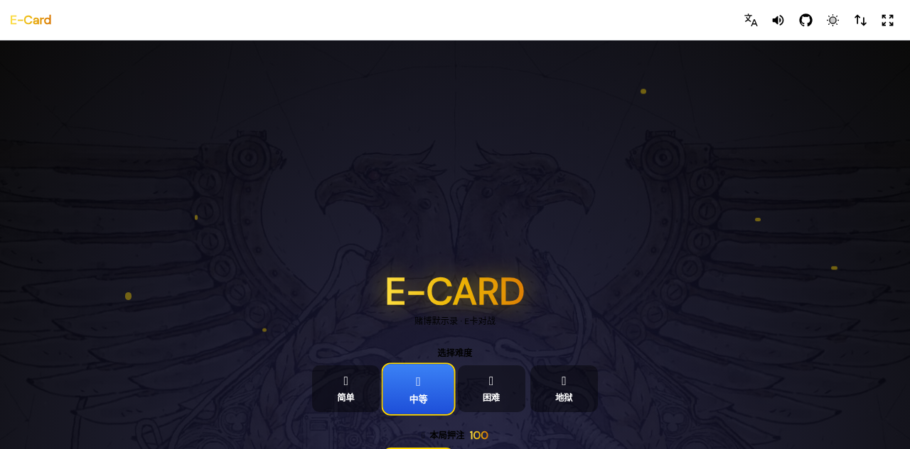
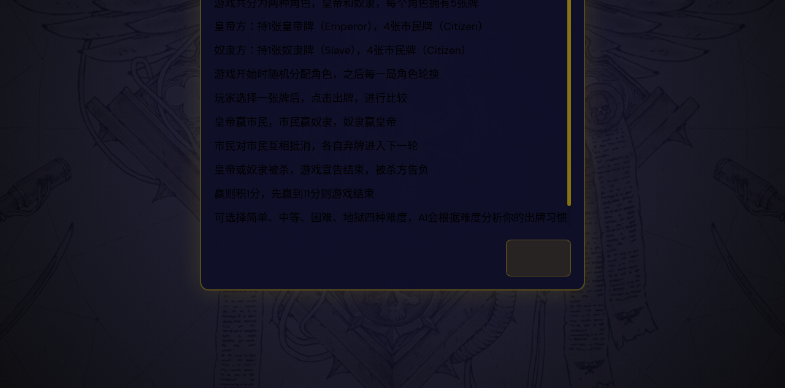
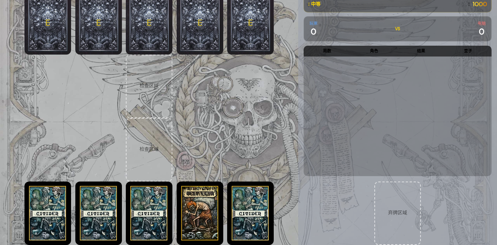
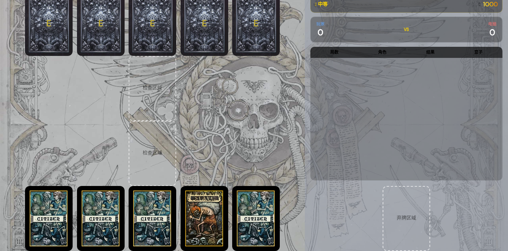
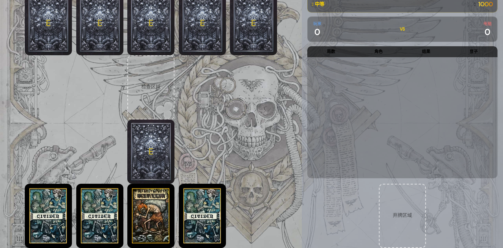
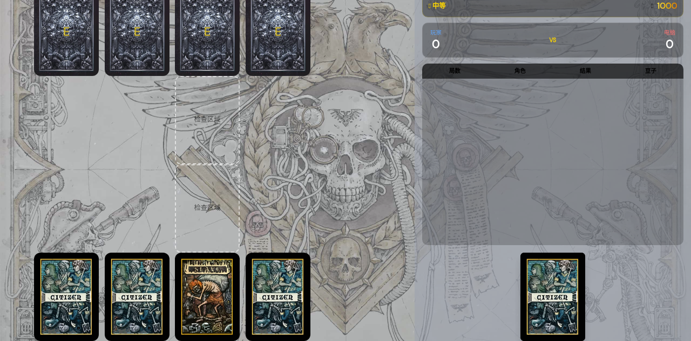
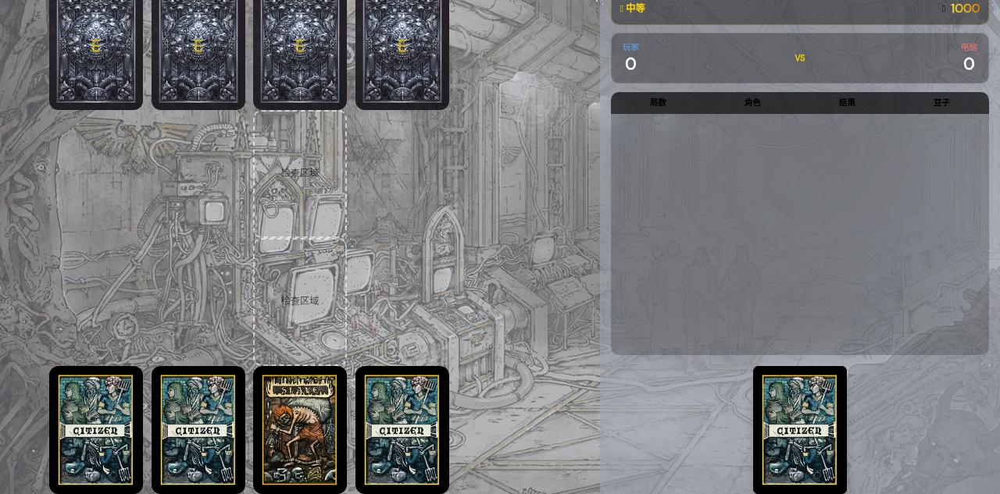
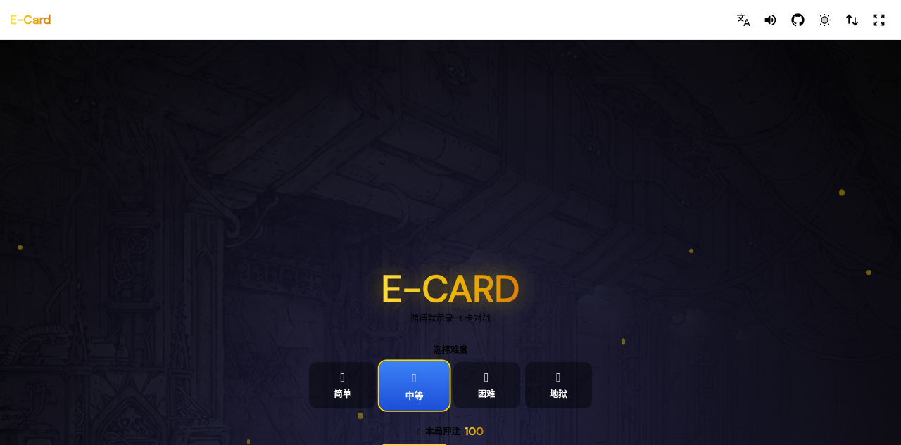
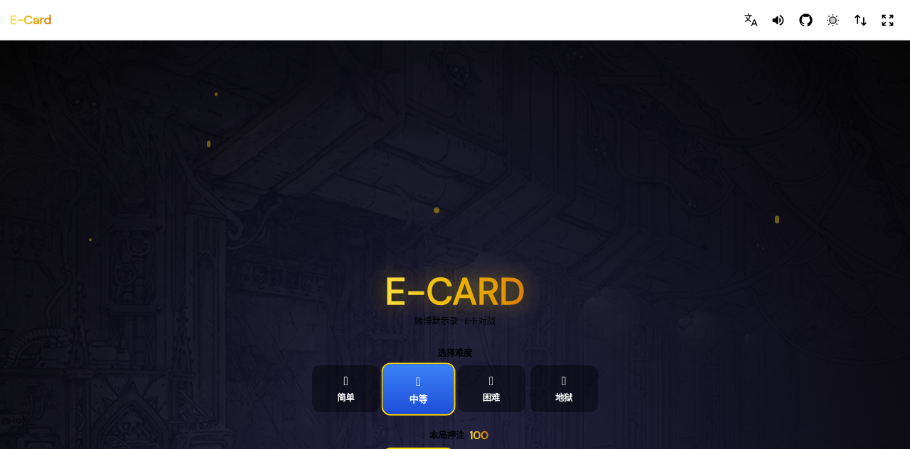

# 仿照《赌博默示录》的 E-Card 小游戏

**中文文档** | [英文文档](./docs/README_EN.md) | [日文文档](./docs/README_JP.md) | [韩文文档](./docs/README_KR.md)

> 一个基于 Vue 3 + UnoCSS + TypeScript 开发的网页版 E-Card 卡牌对战游戏，改编自日本漫画《赌博默示录卡吉》中的经典心理博弈游戏。

## 游戏预览

### 主菜单



主菜单提供以下功能：
- **难度选择**：简单、中等、困难、地狱四档难度
- **押注金额**：每局对战的赌注豆子数量
- **游戏开始**：点击开始进入对战
- **游戏说明**：查看游戏规则
- **制作人员**：查看项目贡献者

### 游戏说明



详细的游戏规则说明，包括角色介绍、胜负关系、得分规则等。

### 角色分配



游戏开始时随机分配皇帝或奴隶角色，每局结束后双方角色互换。

### 游戏界面



游戏主界面包含以下区域：
- **顶部**：电脑手牌（5 张背面朝上的卡牌）
- **中部**：检查区域（用于展示双方打出的卡牌进行比对）
- **底部**：玩家手牌（5 张正面朝上的可操作卡牌）
- **右侧面板**：游戏信息（难度、豆子、比分、对局日志、弃牌区域）

### 出牌选择



玩家点击手牌中的任意一张卡牌即可出牌，电脑 AI 会根据难度等级分析玩家出牌习惯并选择应对策略。

### 弃牌区域



平局时的卡牌会进入弃牌区域，不再归还双方，影响后续对局的策略选择。

### 背景切换



导航栏提供背景图片切换按钮，可在 4 种不同背景间循环切换。

### 胜利结算



当一方豆子归零（破产）或达到胜利条件时，显示结算面板，展示最终比分、豆子变化和对局记录。

### 失败结算



失败结算面板，与胜利结算对称展示，记录本局所有对局详情。

### 制作人员


项目贡献者列表。

## 游戏玩法

### 基本规则

E-Card 是一款不对称心理博弈游戏，双方各自持有 5 张卡牌：

| 角色 | 卡牌组成 |
| --- | --- |
| 皇帝方 | 1 张皇帝牌（Emperor）+ 4 张市民牌（Citizen） |
| 奴隶方 | 1 张奴隶牌（Slave）+ 4 张市民牌（Citizen） |

### 胜负关系

卡牌之间存在相克关系，类似石头剪刀布：

```
皇帝 ──胜──> 市民 ──胜──> 奴隶 ──胜──> 皇帝
                                  ↑__________|
```

| 对战组合 | 结果 |
| --- | --- |
| 皇帝 vs 市民 | 皇帝胜 |
| 市民 vs 奴隶 | 市民胜 |
| 奴隶 vs 皇帝 | 奴隶胜（奴隶逆袭） |
| 市民 vs 市民 | 平局（双方弃牌） |

### 游戏流程

1. **选择难度和押注**：在主菜单选择 AI 难度（简单/中等/困难/地狱）和押注金额（50/100/200）
2. **角色分配**：系统随机分配皇帝或奴隶角色给玩家，电脑获得另一方
3. **出牌阶段**：双方各从 5 张手牌中选择 1 张出牌
4. **比对结果**：系统比对双方卡牌，判定胜负
5. **豆子结算**：根据押注金额和本局结果调整双方豆子数量
6. **角色互换**：下一局双方角色互换
7. **判定终局**：一方豆子归零（破产）即游戏结束

### 难度说明

AI 会根据难度等级智能分析玩家出牌习惯并优化应对策略：

| 难度 | AI 行为 | 思考时长 |
| --- | --- | --- |
| 简单 | 随机出牌为主，较少分析玩家习惯 | 约 300ms |
| 中等 | 偶尔分析玩家习惯，平衡策略 | 约 600ms |
| 困难 | 经常分析玩家习惯，倾向于最优策略 | 约 900ms |
| 地狱 | 深度分析玩家习惯，几乎总是最优策略 | 约 1200ms |

### 豆子系统

- **初始豆子**：双方各 1000 颗
- **押注金额**：每局 50/100/200 颗（可在主菜单选择）
- **破产判定**：豆子归零即视为破产，游戏结束
- **胜利条件**：使对方破产即可获得最终胜利

## 技术栈

| 技术 | 说明 |
| --- | --- |
| Vue 3 | 渐进式 JavaScript 框架，组合式 API |
| TypeScript | 类型安全的 JavaScript 超集 |
| Vite | 下一代前端构建工具 |
| UnoCSS | 即时按需原子化 CSS 引擎 |
| VueUse | Vue 组合式工具函数库 |
| Vue Router | 官方路由管理器 |
| Vue I18n | 国际化多语言插件 |
| Iconify | 图标库（通过 carbon 图标集） |

## 功能特性

- 四种 AI 难度等级，智能分析玩家出牌习惯
- 完整的豆子（筹码）系统和破产机制
- 精美的卡牌 3D 翻转动画和对战打击感
- 多语言支持（中文/英文/日文/韩文）
- 4 种可切换的游戏背景
- 明暗主题色切换
- 全屏模式
- 音效系统（发牌、抽牌、洗牌音效）
- 游戏对局日志记录
- 状态持久化（localStorage）
- 响应式布局，支持移动端

## 开发工具

| 工具 | 说明 | 官网 |
| --- | --- | --- |
| icon | 图标 | [https://icones.js.org/collection/all](https://icones.js.org/collection/all) |
| vueuse | 工具函数 | [https://vueuse.org/functions.html](https://vueuse.org/functions.html) |
| unocss | 原子化样式 | [https://unocss.dev/interactive/](https://unocss.dev/interactive/) |
| grid | 网格布局 | [https://cssgrid-generator.netlify.app/](https://cssgrid-generator.netlify.app/) |

## 项目结构

```
src/
├── assets/          # 静态资源（背景图、卡牌图、音效）
├── i18n/            # 多语言配置（中/英/日/韩）
├── router/          # 路由配置
├── store/           # 全局状态管理（VueUse + persisted）
├── styles/          # 全局样式
├── utils/           # 工具函数（AI 决策、游戏逻辑、音效）
└── views/
    ├── Component/   # 游戏组件（卡牌、菜单、结算面板等）
    ├── Game/        # 游戏主页面
    ├── Layout/      # 布局组件
    ├── NavButton/   # 导航按钮组件
    ├── Others/      # 其他页面（404）
    └── Type/        # TypeScript 类型定义
```

## 本地开发

```bash
# 安装依赖
pnpm install

# 启动开发服务器
pnpm dev

# 构建生产版本
pnpm build

# 预览生产构建
pnpm preview
```

## 部署

项目使用 GitHub Pages 部署，访问地址：[https://smallteddygames.github.io/e-card/](https://smallteddygames.github.io/e-card/)

## License

[MIT](./LICENSE)
